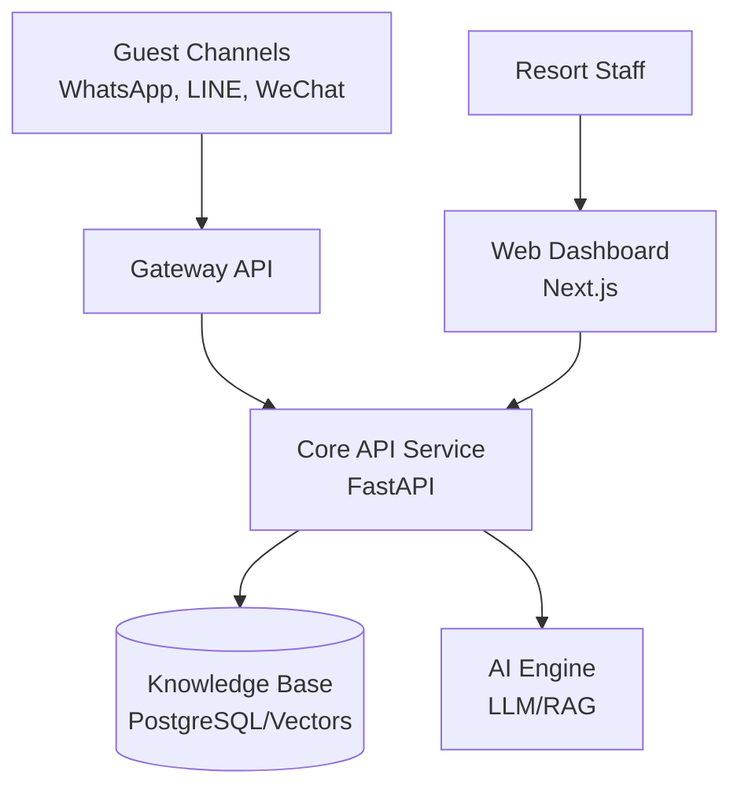

# ResortOS: Luxury Enterprise Management System

[](https://github.com/club-med-mvp)
[](LICENSE)

ResortOS is a premium, AI-first management platform designed for high-end resorts and hospitality groups. Developed as a strategic MVP for Club Med, it streamlines guest interactions, optimizes operational workflows, and provides data-driven insights through a sophisticated luxury enterprise interface.

## 🌟 Key Features

### 🤖 G.M Copilot (AI Tourism Agent)
- **Omnichannel Messaging**: Seamless integration with WhatsApp, LINE, WeChat, Kakao, and Web.
- **24/7 Automation**: Achieves a 35% full automation rate for common inquiries and service requests.
- **AI Translation**: Real-time translation supporting 13+ global markets.

### 🎭 Service-Oriented Demo Simulator
- **Guest Personas**: Realistic profiles with historical spend, LTV (Lifetime Value), and loyalty tiers (Platinum, Gold, Silver).
- **Strategic Scenarios**: Pre-built interaction flows including:
  - **Borneo 2026**: Eco-initiative and BREEAM certification inquiries for the new Borneo resort.
  - **VIP Concierge**: High-stakes room upgrade and anniversary special requests.
  - **Urgent SLA Management**: Critical service issue tracking with real revenue-at-risk metrics.

### 📊 Luxury Enterprise Dashboard
- **Strategic Metrics**: Real-time tracking of LTV, Average Response Time, and AI Automation Rate.
- **SLA Monitoring**: Visual indicators for response times and service level agreements.
- **Sentiment Analysis**: Proactive monitoring of guest satisfaction across all channels.

## 🏗️ Architecture



- **Apps**:
  - `apps/core`: Backend API service (Python/FastAPI)
  - `apps/web`: Admin dashboard (TypeScript/Next.js)
  - `apps/gateway`: Channel integration layer
- **Packages**:
  - `packages/schemas`: Shared data models and types

## 🚀 Getting Started

### Prerequisites
- Python 3.11+
- Node.js 18+
- Docker & Docker Compose

### Fast Start
1. Clone the repository:
   ```bash
   git clone https://github.com/organization/club-med-mvp.git
   cd club-med-mvp
   ```
2. Start the core services:
   ```bash
   docker-compose up -d
   ```
3. Access the dashboard:
   Open [http://localhost:3000](http://localhost:3000)

## 📖 Documentation
Detailed technical and strategic documentation can be found in the `docs/` directory:
- [Strategic Realignment](docs/strategy.md)
- [API Specification](docs/api/README.md)
- [Fosun & Club Med Research](docs/club_med_fosun_research.md)

---
© 2026 ResortOS. Proprietary and Confidential.
