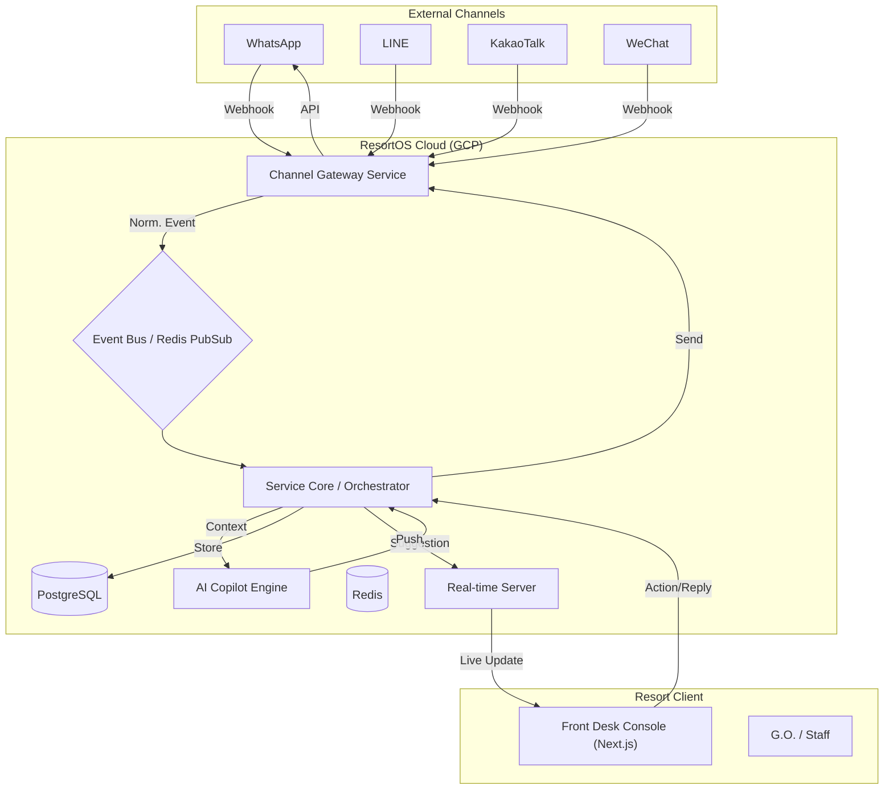

# MVP Implementation Plan: ResortOS "Service Layer"

**Goal:** Build a robust, modular, unified inbox for Resort Front Desks to manage WhatsApp, Line, KakaoTalk, and WeChat interactions with AI assistance.
**Success Criteria:** >90% probability of alleviating "Channel Chaos" and demonstrating immediate value (Headcount/Efficiency).

## 1. High-Level Architecture: The "Modular Hub"

We will adopt a **Event-Driven Modular Monolith** architecture. This balances separation of concerns (modularity) with ease of deployment and maintenance (simplicity) for the MVP.

## 2. Component Blueprint

### A. The Channel Gateway (The "Adapter")
*   **Purpose:** Abstract away the complexity of different providers. Consumes webhooks, normalizes them into a standard `UnifiedMessage` schema, and pushes to the Event Bus.
*   **Tech:** Python (FastAPI) or Go.
*   **Key Feature:** "Provider Agnostic." If we switch from Twilio to MessageBird, only this component changes.
*   **MVP Support:**
    *   WhatsApp (via Twilio or Meta Graph API)
    *   Line (Official API)
    *   KakaoTalk (via Solapi or Official API - *Risk: Complex approval, fallback to proxy*)
    *   WeChat (via Official Account Platform)

### B. The Service Core (The "Orchestrator")
*   **Purpose:** The brain using "Inbox Logic." Handles session management (assigning guest to thread), routing (assign to specific G.O.), and business rules (SLA timers).
*   **Tech:** Python (FastAPI).
*   **Data Model:**
    *   `Guest`: The human profile (linked to phone/social ID).
    *   `Thread`: The conversation context.
    *   `Message`: The normalized content (Text, Image, Location).

### C. The AI Copilot Engine (The "Brain")
*   **Purpose:** Stateless microservice for intelligence.
*   **Capabilities:**
    1.  **Polyglot Translator:** Auto-translate incoming to English, outgoing to Target Lang.
    2.  **Intent Classifier:** "Is this a complaint, a request (towel), or info?"
    3.  **Draft Generator:** Suggest replies based on Resort Knowledge Base (RAG).
*   **Tech:** LangChain + OpenAI (GPT-4o mini for speed) + Qdrant/Chroma (Vector DB for SOPs).

### D. The Real-Time Console (The "Glass")
*   **Purpose:** The SINGLE screen for the Front Desk.
*   **UX focus:** "Zero Latency." Messages must appear instantly.
*   **Tech:** Next.js (React), Tailwind CSS, Socket.io.
*   **Design:**
    *   **Left Rail:** Unified Feed (Sorted by Urgency/SLA).
    *   **Center:** Chat View (Guest Lang + English Translation).
    *   **Right Rail:** AI Copilot (Suggestions, Guest Details, Quick Actions).

## 3. Technology Stack & Tooling

| Component | Choice | Rationale |
| :--- | :--- | :--- |
| **Backend** | Python (FastAPI) | Extensive AI libraries, fast dev speed, strong typing (Pydantic). |
| **Frontend** | Next.js (TypeScript) | Industry standard, robust, easy to deploy. |
| **Database** | PostgreSQL | Reliability, relational data integrity, JSONB support for message flexibility. |
| **Real-time** | Redis Pub/Sub + Socket.io | Simple, battle-tested real-time pipe. |
| **AI LLM** | OpenAI API | Best performance for multi-lingual translation/nuance. |
| **Infrastructure** | Google Cloud Run | Serverless (Asset-light!), auto-scaling, low maintenance. |
| **Monitoring** | Sentry + OpenTelemetry | Instant visibility into "Why did this message fail?". |

## 4. Implementation Stages

### Stage 1: The "Skeleton" (Week 1-2)
*   [ ] Set up Monorepo (TurboRepo).
*   [ ] Deploy "Hello World" Gateway, Core, and Frontend to Cloud Run.
*   [ ] Implement **WhatsApp** webhook ingestion (easiest channel).
*   [ ] Verify Real-time pipe (Webhook -> Gateway -> UI).

### Stage 2: The "Polyglot" (Week 3-4)
*   [ ] Add **Line** & **WeChat** Adapters.
*   [ ] Implement `TranslationService` using LLM.
*   [ ] **Crucial Test:** Send Japanese Line msg -> See English in UI -> Reply English -> Receive Japanese on Line.

### Stage 3: The "Copilot" (Week 5-6)
*   [ ] Ingest PDF SOPs (Club Med documents) into Vector DB.
*   [ ] Build "Smart Reply" checking SOPs.
*   [ ] Implement "SLA Alarm" (UI turns red if no reply in 5 mins).

### Stage 4: Robustness & Polish (Week 7-8)
*   [ ] Failure handling (what if WhatsApp is down?).
*   [ ] Security (Role Based Access Control - Manager vs Staff).
*   [ ] "Offline Mode" handling.

## 5. Maintenance & Monitoring Strategy
*   **"Traffic Lights" Dashboard:** Simple status page: "WhatsApp: Green", "Line: Green", "AI: Yellow".
*   **Error Budgets:** Alert only if >1% of messages fail.
*   **One-Click Deploy:** GitHub Actions pipeline.

## 6. Pre-Requisites
*   [ ] Accounts: Twilio (WA), Line Developers, WeChat Official Account.
*   [ ] Cloud: GCP Project setup.
*   [ ] OpenAI API Keys.

## User Review Required
> [!IMPORTANT]
> **Channel Access:** Getting verified Business Accounts for WhatsApp (WABA), Line, and especially **KakaoTalk/WeChat** can take weeks of verification. We must start this application process **IMMEDIATELY** with a generic company entity if Club Med's credentials are not yet available.

> [!WARNING]
> **WeChat Constraints:** Official Accounts have a 48-hour reply window. We must design the UI to warn staff if a thread is about to expire.
