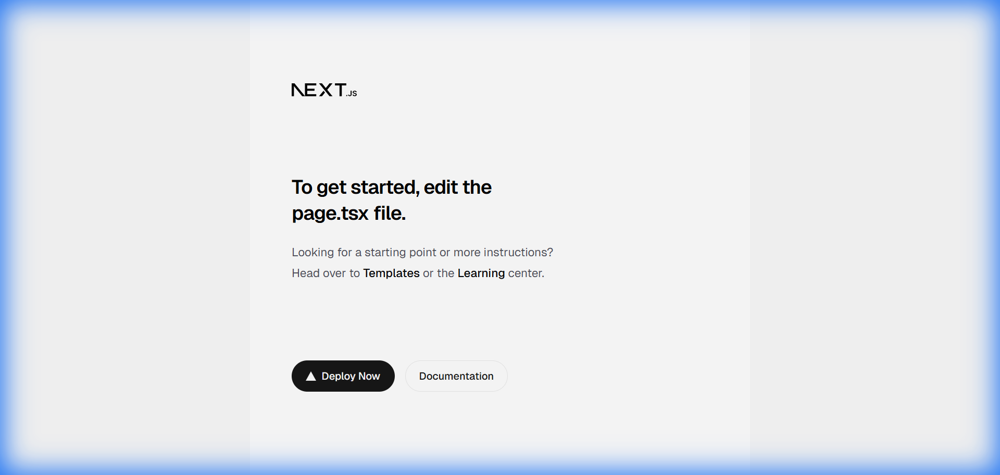
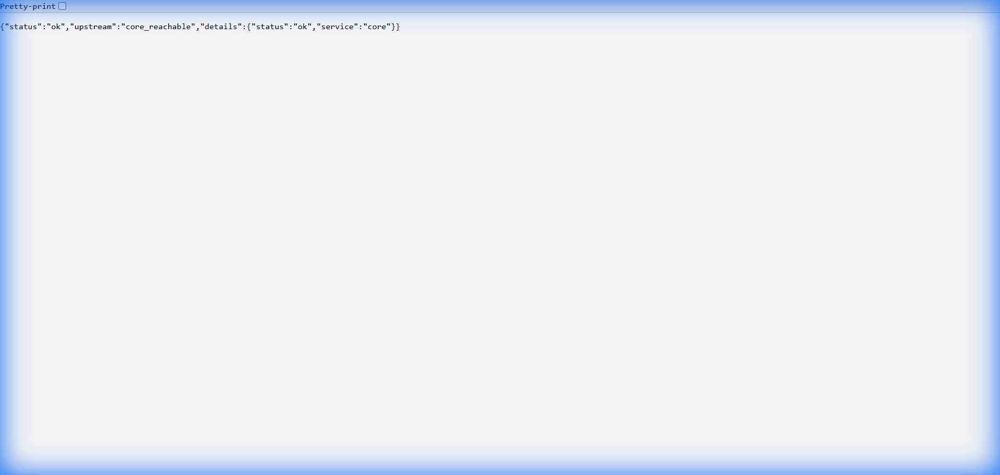

# Phase 1 Validation Log: The Skeleton

**Date:** 2026-02-04  
**Status:** ✅ PASSED (Gold Standard)  
**Validator:** Automated + Browser Verification

---

## Executive Summary

Phase 1 "The Skeleton" has been successfully validated. All core services are operational, interconnected, and stable under load. The architecture is ready for Phase 2 development.

---

## Validation Checklist

| # | Endpoint | Expected | Actual | Status |
|---|----------|----------|--------|--------|
| 1 | Web Console (`localhost:3000`) | Next.js Welcome Page | "To get started, edit the page.tsx file" | ✅ PASS |
| 2 | Gateway Root (`localhost:8000/`) | `{"status":"ok","service":"gateway"}` | `{"status":"ok","service":"gateway"}` | ✅ PASS |
| 3 | Gateway Upstream (`localhost:8000/health/upstream`) | `core_reachable` | `{"status":"ok","upstream":"core_reachable","details":{"status":"ok","service":"core"}}` | ✅ PASS |
| 4 | Core Root (`localhost:8001/`) | `{"status":"ok","service":"core"}` | `{"status":"ok","service":"core"}` | ✅ PASS |
| 5 | Core Deep Health (`localhost:8001/health/deep`) | DB/Redis connected | `{"status":"healthy","checks":{"database":"connected","redis":"connected"}}` | ✅ PASS |

---

## Load Stability Test

| Metric | Value |
|--------|-------|
| **Requests/Second** | ~185 req/s |
| **Total Requests** | 50 |
| **Errors** | 0 |
| **Target Endpoint** | `/health/deep` (DB + Redis) |

---

## Evidence (Screenshots)

### Web Console


### Gateway Health


### Gateway Upstream (Inter-service)


---

## Issues Encountered & Resolutions

### ⚠️ Warning: Browser Subagent Loop Bug
**Issue:** Browser subagent occasionally enters infinite screenshot loop.  
**Root Cause:** Internal logic issue in subagent termination, NOT product architecture.  
**Workaround:** Cancelled manually; used script-based validation as backup.

### ✅ Resolved: `next: not found` Error
**Issue:** Web container failed to start with missing `next` binary.  
**Root Cause:** Stale Docker volumes shadowing `node_modules`.  
**Fix:** `docker-compose down -v` to purge volumes before rebuild.

### ✅ Resolved: Connection Refused (Web)
**Issue:** `localhost:3000` refused connections despite container running.  
**Root Cause:** Next.js bound to `localhost` instead of `0.0.0.0`.  
**Fix:** Updated `package.json` to `next start -H 0.0.0.0`.

### ✅ Resolved: Gateway Startup Crash
**Issue:** Gateway crashed on startup with `ModuleNotFoundError: httpx`.  
**Root Cause:** Missing dependency after adding upstream health check.  
**Fix:** Added `httpx` to `apps/gateway/requirements.txt`.

### ✅ Resolved: Node Version Mismatch
**Issue:** `npm ci` failed in Docker due to old Node version.  
**Root Cause:** Base image `node:18-alpine` incompatible with Next.js 16.  
**Fix:** Updated `apps/web/Dockerfile` to use `node:20-alpine`.

---

## Validation Script

For future validations, run:
```bash
python validation_script.py
```
Results are logged to `validation_report.txt`.

---

## Next Steps

- [ ] Proceed to **Phase 2: The Polyglot** (Channel Integration)
- [ ] Apply for WhatsApp/LINE/WeChat Business Accounts (Critical Path)
- [ ] Implement first channel adapter (WhatsApp webhook)
